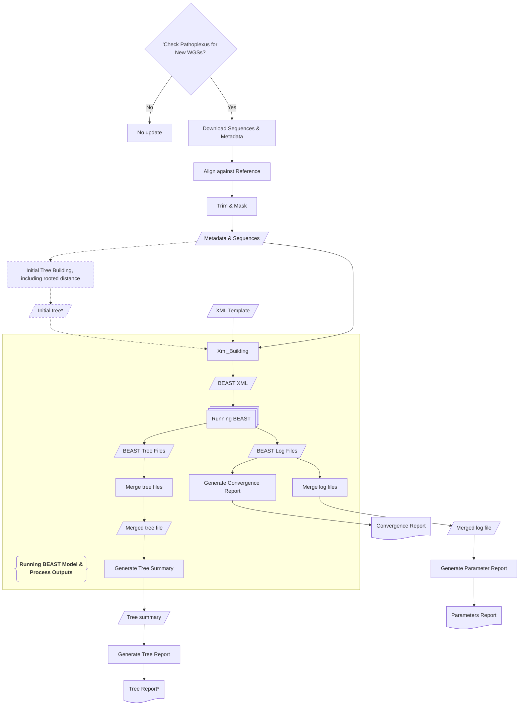

```mermaid
flowchart TD
    check_pathoplexus{'Check Pathoplexus for New WGSs?'}
    check_pathoplexus -- No --> End[No update]
    check_pathoplexus -- Yes --> Download_Sequences[Download Sequences & Metadata]
    Download_Sequences --> Align[Align against Reference]
    Align-->Trim[Trim & Mask] --> Metadata_Sequences 
    Metadata_Sequences@{ shape: in-out, label: "Metadata & Sequences" } -.-> Initial_tree_building[Initial Tree Building]


    Initial_tree_building[Initial Tree Building, including rooted distance] -.-> Initial_tree@{ shape: in-out, label: "Initial tree*" }
    Initial_tree -.->  Xml_Building
    Metadata_Sequences --> Xml_Building

    Xml_template@{ shape: in-out, label: "XML Template" } --> Xml_Building
    subgraph Running_BEAST_etc [" "]
      Running_BEAST_etc_tital@{ shape: braces, label: "**Running BEAST Model &\n Process Outputs**"}
      Xml_Building --> XML@{ shape: in-out, label: "BEAST XML" }
  
  
      XML --> Beast@{ shape: processes, label: "Running BEAST" }
      Beast --> Beast_trees@{ shape: in-out, label: "BEAST Tree Files" }
      Beast_trees --> Merge_tree_files[Merge tree files]
      Merge_tree_files --> tree_file@{ shape: in-out, label: "Merged tree file" } 
      tree_file --> Gen_tree_summary[Generate Tree Summary]
      Beast --> Beast_logs@{ shape: in-out, label: "BEAST Log Files" }
      Beast_logs --> Convergence_Report_gen[Generate Convergence Report]
      Beast_logs --> Merge_log_files[Merge log files]    
    end
    Merge_log_files --> log_file@{ shape: in-out, label: "Merged log file" }
    log_file --> gen_params_report[Generate Parameter Report]
    gen_params_report --> Params_Report@{ shape: doc, label: "Parameters Report" }
    Convergence_Report_gen --> Convergence_Report@{ shape: doc, label: "Convergence Report" }
    gen_tree_report --> Tree_Report@{ shape: doc, label: "Tree Report*" }
    Gen_tree_summary --> summary_file@{ shape: in-out, label: "Tree summary" }
    summary_file --> gen_tree_report[Generate Tree Report]

    classDef dashed stroke-dasharray: 5 5;

    
    class Initial_tree_building,Initial_tree dashed;


```