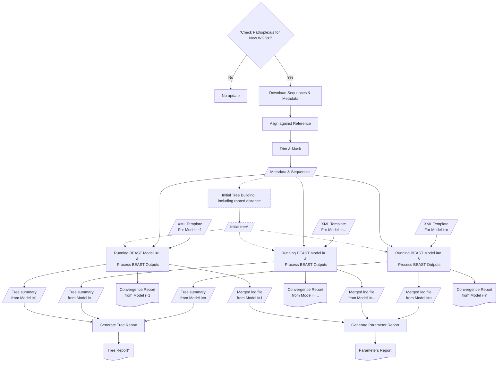

```mermaid
flowchart TD
    check_pathoplexus{'Check Pathoplexus for New WGSs?'}
    check_pathoplexus -- No --> End[No update]
    check_pathoplexus -- Yes --> Download_Sequences[Download Sequences]
Download_Sequences[Download Sequences & Metadata] --> Align[Align against Reference]
    Align-->Trim[Trim & Mask] --> Metadata_Sequences 
    Metadata_Sequences@{ shape: in-out, label: "Metadata & Sequences" } -.-> Initial_tree_building[Initial Tree Building]


    Initial_tree_building[Initial Tree Building, including rooted distance] -.-> Initial_tree@{ shape: in-out, label: "Initial tree*" }

    Initial_tree -.->  Running_BEAST_etc_A[Running BEAST Model i=1 &\n Process BEAST Outputs]
    Metadata_Sequences --> Running_BEAST_etc_A
    Xml_template_A@{ shape: in-out, label: "XML Template\nFor Model i=1" } --> Running_BEAST_etc_A
    Running_BEAST_etc_A --> summary_file_A@{ shape: in-out, label: "Tree summary\nfrom Model i=1" }
    Running_BEAST_etc_A --> log_file_A@{ shape: in-out, label: "Merged log file\nfrom Model i=1" } 
    Running_BEAST_etc_A --> Convergence_Report_A@{ shape: doc, label: "Convergence Report\nfrom Model i=1" }
    log_file_A --> gen_params_report[Generate Parameter Report]
    summary_file_A --> gen_tree_report[Generate Tree Report]

    Initial_tree -.->  Running_BEAST_etc_B[Running BEAST Model i=... &\n Process BEAST Outputs]
    Metadata_Sequences --> Running_BEAST_etc_B
    Xml_template_B@{ shape: in-out, label: "XML Template\nFor Model i=..." } --> Running_BEAST_etc_B
    Running_BEAST_etc_B --> summary_file_B@{ shape: in-out, label: "Tree summary\nfrom Model i=..." }
    Running_BEAST_etc_B --> log_file_B@{ shape: in-out, label: "Merged log file\nfrom Model i=..." } 
    Running_BEAST_etc_B --> Convergence_Report_B@{ shape: doc, label: "Convergence Report\nfrom Model i=..." }
    log_file_B --> gen_params_report[Generate Parameter Report]
    summary_file_B --> gen_tree_report[Generate Tree Report]

    Initial_tree -.->  Running_BEAST_etc_C[Running BEAST Model i=n &\n Process BEAST Outputs]
    Metadata_Sequences --> Running_BEAST_etc_C
    Xml_template_C@{ shape: in-out, label: "XML Template\nFor Model i=n" } --> Running_BEAST_etc_C
    Running_BEAST_etc_C --> summary_file_C@{ shape: in-out, label: "Tree summary\nfrom Model i=n" }
    Running_BEAST_etc_C --> log_file_C@{ shape: in-out, label: "Merged log file\nfrom Model i=n" } 
    Running_BEAST_etc_C --> Convergence_Report_C@{ shape: doc, label: "Convergence Report\nfrom Model i=n" }
    log_file_C --> gen_params_report[Generate Parameter Report]
    summary_file_C --> gen_tree_report[Generate Tree Report]


    gen_params_report --> Params_Report@{ shape: doc, label: "Parameters Report" }

    gen_tree_report --> Tree_Report@{ shape: doc, label: "Tree Report*" }

    classDef dashed stroke-dasharray: 5 5;

    
    class Initial_tree_building,Initial_tree dashed;
    class Diagnostic,log_file,Params_Report,summary_file,Tree_Report phase5;


```
