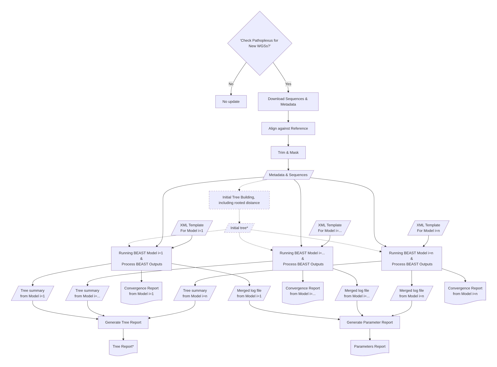

# Ebola-Flow

## Introduction

Ebola-Flow is a Nextflow pipeline for phylodynamic analysis of 2026 outbreak Ebola Bundibugyo Virus (EBDBV) WGSs from [Pathoplexus](https://pathoplexus.org/ebola-bdbv/search). This pipeline uses components from [BEAST_pype](https://github.com/m-d-grunnill/BEAST_pype) with a specific focus on EBDBV, similar to [CoV-Flow](https://peercommunityjournal.org/articles/10.24072/pcjournal.333/).

## Pipeline Overview

The pipeline performs the following steps:

1. **Check for new submissions** *(optional, daily_run profile)* — query Pathoplexus for today's submissions; exit early if none found, producing a README.md with the last submission date
2. **Fetch sequences & metadata** from Pathoplexus (or use local FASTA), filtering by minimum sequence length (default 18,000 bp)
3. **Clean metadata** — convert JSON→TSV, filter excluded IDs (supports both `accession` and `accessionVersion` lookups), remove sequences with invalid collection dates
4. **Filter FASTA** — remove excluded/invalid sequences via seqkit
5. **Trim sequences** *(optional)* — trim all sequences to a maximum length (default 18,900 bp) to remove trailing noise
6. **Fetch outgroup sequences** *(optional)* — download additional sequences from Pathoplexus within a specified date range for tree rooting context
7. **Clean outgroup** — cross-reference against the Nextclade reference to avoid duplicates, round incomplete dates to mid-month
8. **Merge FASTA** — combine main sequences + outgroup sequences before alignment
9. **Nextclade** — align all sequences together and perform QC
10. **IQ-TREE** — build an initial phylogenetic tree (optionally using reference/outgroup as outgroup for rooting, with `-keep-ident` to preserve identical sequences)
11. **Generate TempEst metadata** — produce date files for temporal signal analysis (with and without reference/outgroup)
12. **TreeTime (pre-filter)** — run TreeTime CLI for clock filtering and temporal signal assessment
13. **TreeTime Stats (pre-filter)** — generate root-to-tip regression PNG + clock model stats YAML (including TMRCA as both decimal year and calendar date)
14. **Filter Sequences** — remove outliers, outgroup, and reference from the tree, FASTA, and metadata
15. **Downsample** *(optional)* — residual-based temporal downsampling that preferentially removes sequences with high clock residuals
16. **IQ-TREE (post-filter)** *(only if downsampling)* — rebuild tree on downsampled data
17. **TreeTime (post-filter)** *(only if downsampling)* — re-run TreeTime on the post-filter IQ-TREE output
18. **TreeTime Stats (post-filter)** *(only if downsampling)* — generate post-filter root-to-tip PNG + stats
19. **Emergence analysis** — variant emergence surveillance report combining the raw IQ-TREE diversity tree, the clock-cleaned genetic-distance tree, the temporal tree, and metadata into an R Markdown report flagging candidate emergence/clock outliers
20. **BEAST2 XML generation** — generate BEAST2 XML(s) from template(s) using the filtered/downsampled alignment and initial tree
21. **BEAST2** — install required packages (e.g., BDMM-Prime) and run MCMC chains (output files prefixed with the template ID, e.g. `<template_id>_rep_1.log`, `<template_id>_rep_2.trees`, etc.)
22. **Data and run stats report** — consolidated report covering the Pathoplexus fetch date/time, metadata stats for the raw pull, post–`clean_metadata` data, and outlier-removed data, plus per-model BEAST2 run times (replaces the former standalone metadata report)
23. **BEAST_pype diagnostics** — merge logs/trees, run convergence diagnostics producing a report per set of runs
24. **TreeAnnotator** — summarise posterior tree(s) in low-memory mode with a JVM heap sized to the task's allocated memory
25. **BEAST_pype reports** — generate parameters report and summary tree report(s)

## Profiles

| Profile           | Description                                                                                                                                                |
| -------------------| ------------------------------------------------------------------------------------------------------------------------------------------------------------|
| `test_single_xml` | Minimal test with a single BEAST2 XML template. Fixed seed for reproducibility. Low-memory TreeTime options (`JC69`, no stochastic resolve).               |
| `test_multi_xml`  | Test with two BEAST2 XML templates for comparative reporting. Fixed seed. Low-memory TreeTime options.                                                     |
| `ad_hoc`          | Production run with multiple templates, 15 BEAST repeats, random seed. No outgroup or reference used for tree rooting. Always runs (no submission check). Uses BDMM-Prime. Timestamped output. |
| `daily_run`       | Same as `ad_hoc` but checks for new Pathoplexus submissions today before proceeding. Exits early if none found.                                            |
| `build_envs`      | Utility profile for pre-building conda environments via `-stub-run`. Does not run analysis.                                                                |

Profiles are combined with an environment manager and optionally a scheduler:

```bash
nextflow run main.nf -profile <profile>,<env>,<scheduler>
```

For example:

```bash
nextflow run main.nf -profile ad_hoc,mamba,slurm
```

## Usage

**Note if you are using conda environments on a HPC such as pancakes.** 

Creating conda environments on a HPC is incredibly slow due to limited internet bandwidth and filesystem overhead on shared storage. If conda environments need to be created (e.g., first run from a new location, or after a dependency change), you should pre-build them from a **VM that shares the same filesystem** rather than directly on the HPC. To do this from such a VM activate a conda environment containing Nextflow first (e.g., `conda activate nextflow-26.04.4`) and then run: 

```bash
nextflow run main.nf -profile build_envs,mamba -stub-run
```

This creates all conda environments under `work/conda` without running the actual analysis. Once built, subsequent runs on the HPC will reuse the cached environments and start quickly.

After the stub run completes, you can safely delete the `build_envs_results/` output directory — it only contains empty placeholder files:

```bash
rm -rf build_envs_results/
```

Environments will need to be rebuilt if:
- You run the pipeline from a new working directory (different `work/conda` path).
- A module's `environment.yml` has a dependency added/removed or a version number changed.

### Basic local run

```bash
nextflow run main.nf \
    --template_xml ./template_beast_xmls/for_use_in_tests/coal_exp_fixed_clock_1_2e-3.xml \
    --exclude_ids ./conf/exclude_list.txt \
    --beast_repeats 3 \
    --build_initial_tree true \
    --outdir results \
    --pathoplexus_date_from '2026-01-01' \
    -profile mamba
```

### Testing

```bash
# Single XML template test
nextflow run main.nf -profile test_single_xml,mamba

# Multi-XML comparative test
nextflow run main.nf -profile test_multi_xml,mamba
```

### Ad-hoc production run

```bash
nextflow run main.nf -profile ad_hoc,mamba,slurm --outdir_base desired_folder
```

Output is saved to a timestamped folder under what you set to `--outdir_base`.

### Daily scheduled run

```bash
nextflow run main.nf -profile daily_run,mamba,slurm --outdir_base desired_folder
```

Checks Pathoplexus for new submissions today. If none are found, the pipeline exits cleanly without running BEAST2.

### Stopping at a specific step

Use the `--stop_after` parameter to halt the pipeline after a specific stage:

```bash
nextflow run main.nf -profile ad_hoc,mamba --stop_after treetime
```

Valid values for `--stop_after`:

| Value | Stops after |
|-------|-------------|
| `'nextclade'` | Alignment (before IQ-TREE) |
| `'iqtree'` | IQ-TREE (before TreeTime) |
| `'treetime'` | TreeTime analysis (before BEAST2_XML_GEN) |
| `'beast2_xml_gen'` | XML generation (before running BEAST2) |
| `null` (default) | Runs the full pipeline |

### Tree building options

The pipeline supports several modes for building the initial phylogenetic tree:

| Parameter | Description |
|-----------|-------------|
| `--build_initial_tree true` | Build tree with IQ-TREE (no reference/outgroup rooting) |
| `--build_initial_tree_with_reference true` | Build tree using the Nextclade reference genome as an outgroup for rooting |
| `--outgroup_date_from` / `--outgroup_date_to` | Fetch additional outgroup sequences for tree rooting (works with either tree building mode) |

When **outgroup + reference** are both specified, IQ-TREE roots at the MRCA of all outgroup + reference taxa. When only an **outgroup** is used (without reference), IQ-TREE roots at the first outgroup sequence. In all cases, outgroup/reference taxa are **pruned** before BEAST2 so only study sequences enter the phylodynamic analysis.

### TreeTime options

TreeTime is used for temporal signal analysis and clock filtering. The following options are configurable:

| Parameter | Default | Description |
|-----------|---------|-------------|
| `treetime_gtr` | `'infer'` | Substitution model. Use `'JC69'` for low memory |
| `treetime_stochastic_resolve` | `true` | Stochastic polytomy resolution. Set `false` for low memory |
| `treetime_time_marginal` | `null` (disabled) | Marginal dating: `'only-final'`, `'always'`, `'never'` |
| `treetime_covariation` | `false` | Covariation-aware mode (memory-intensive) |
| `treetime_clock_filter` | `3.0` | Clock filter threshold (z-score). Set to `null` to disable |
| `treetime_clock_filter_method` | `'local'` | `'local'` (z-score) or `'residual'` (IQD) |
| `downsample_to` | `null` | Downsample to this many tips (null = no downsampling) |

> **Note**: Test profiles override `treetime_gtr = 'JC69'` and `treetime_stochastic_resolve = false` for low-memory local execution.

### Emergence analysis options

After TreeTime, the pipeline runs an emergence surveillance report (`EMERGENCE_ANALYSIS`) that overlays the raw diversity tree, the clock-cleaned genetic-distance tree, and the temporal tree with metadata to flag candidate emergence/clock outliers. Its behaviour is controlled by:

| Parameter | Default | Description |
|-----------|---------|-------------|
| `emergence_y_cut_val` | `0.00081` | Root-to-tip divergence (subs/site) y-axis cutoff used to flag candidate emergence outliers |
| `emergence_n_sd` | `3` | Width (in standard deviations) of the root-to-tip regression envelope used to detect clock outliers |

Report output is published to `<outdir>/emergence_analysis`.

### Creating or editing a profile

Profiles are defined as `.config` files in the `conf/` directory. To create a new profile or customise an existing one:

1. **Copy an existing config** as a starting point:

   ```bash
   cp conf/ad_hoc.config conf/my_custom.config
   ```

2. **Edit the parameters** in the `params {}` block. Key parameters you may want to change:

   ```nextflow
   params {
       config_profile_name        = 'My custom profile'
       config_profile_description = 'Description of what this profile does'

       // BEAST2 XML templates — single or list
       template_xml               = "${projectDir}/path/to/template.xml"
       // For multiple templates (comparative analysis):
       // template_xml            = [
       //     "${projectDir}/path/to/template_1.xml",
       //     "${projectDir}/path/to/template_2.xml"
       // ]

       // Sequence filtering
       exclude_ids                = "${projectDir}/conf/exclude_list.txt"
       filter_invalid_dates       = true
       trim_max_length            = 18900     // Trim sequences to this length (null to disable)

       // BEAST2 run options
       beast_repeats              = 15        // Number of MCMC chains per template
       // beast_seed              = 42        // Set for reproducibility, omit for random
       beast2_packages            = 'BDMM-Prime'  // Comma-separated BEAST2 packages to install

       // Pathoplexus download filters
       pathoplexus_date_from      = '2026-01-01'   // Only fetch sequences collected from this date
       pathoplexus_length_from    = 18000           // Minimum sequence length
       // pathoplexus_submitted_date = '2026-06-06' // Restrict to submissions on a specific day

       // Tree building
       build_initial_tree         = true      // Build tree with IQ-TREE (no reference rooting)
       // build_initial_tree_with_reference = true  // Use reference for rooting instead

       // Outgroup sequences (optional — for tree rooting context)
       // outgroup_date_from      = '2007-01-01'
       // outgroup_date_to        = '2007-12-31'
       // outgroup_length_from    = 18000

       // TreeTime options
       // treetime_gtr            = 'infer'   // 'infer' or 'JC69'
       // treetime_clock_filter   = 2.0       // z-score threshold for outlier removal
       // downsample_to           = 50        // Downsample to N tips

       // Check for new submissions before running (useful for scheduled jobs)
       // check_new_submissions   = true

       // Reference genome date (for TempEst metadata when using reference)
       // reference_date          = '2007-11'

       // Output directory
       outdir                     = "/path/to/output"
   }
   ```

3. **Optionally set resource limits** in the `process {}` block:

   ```nextflow
   process {
       resourceLimits = [
           cpus:   4,
           memory: '15.GB',
           time:   '1.d'
       ]
   }
   ```

4. **Register the profile** in `nextflow.config` by adding an entry in the `profiles {}` block:

   ```nextflow
   profiles {
       // ...existing profiles...
       my_custom { includeConfig 'conf/my_custom.config' }
   }
   ```

5. **Run with your new profile**:

   ```bash
   nextflow run main.nf -profile my_custom,mamba
   ```

> **Tip**: You can also override individual parameters from the command line without editing a config file:
> ```bash
> nextflow run main.nf -profile ad_hoc,mamba --beast_repeats 5 --outdir ./my_results --stop_after treetime
> ```

### Exclude list format

The exclude list (`exclude_ids` parameter) is a CSV file with a header row and the following columns:

| Column | Required | Description |
|--------|----------|-------------|
| `accession` | Yes | The sequence ID to exclude (see supported formats below) |
| `reason_for_removal` | No | Free-text reason the sequence was excluded (e.g. `Signatures of ADAR editing`) |
| `source_for_reason` | No | Where the exclusion decision came from (e.g. a publication/virological.org URL, reviewer, or ticket) |

Only the `accession` column is used for filtering; `reason_for_removal` and `source_for_reason` are for provenance/record-keeping and may be left blank. The `accession` column supports two formats:

- **`accessionVersion`** (e.g., `PP_006X5RB.1`) — matched directly against sequence IDs
- **`accession`** (e.g., `PP_006X5RB`) — looked up in the metadata's `accession` field and resolved to the full `accessionVersion`

This allows you to exclude sequences using either format without needing to know the exact version suffix.

Example:

```csv
accession,reason_for_removal,source_for_reason
PP_006Y8S4,,
PP_00764QW,Signatures of ADAR editing,https://virological.org/t/phylodynamics-and-evolution-of-the-2026-bundibugyo-virus-circulating-in-the-democratic-republic-of-the-congo-insights-from-a-100-day-window-of-genomic-sequencing/1046
```

The `CLEAN_METADATA` step publishes an `<prefix>_excluded_samples.csv` file to
`<outdir>/clean_metadata`. This is a provenance record of every sample actually
removed during the run — it combines the matched exclude-list entries with any
sequences dropped for having an invalid collection date (reason
`Invalid collection date (not YYYY-MM-DD): <value>`, source
`clean_metadata date filter`). Columns: `accessionVersion`, `accession`,
`reason_for_removal`, `source_for_reason`.

Running the pipeline on the Pancakes HPC via SLURM batch scripts and scheduling
recurring runs with scrontab is documented in the [root `README.md`](../../README.md).

## Pipeline Workflow Diagrams



## Credits

ebola-flow was originally written by Martin Grunnill. Carmen Lia Murrall contributed the original version of the R script used in the Emergence Analysis module.

Significant contributions to pipeline development, module design, and documentation were made by Claude Opus 4.6 (Anthropic), acting as an AI coding assistant via Positron IDE Version: 2026.01.0 build 147.


## Citations

An extensive list of references for the tools used by the pipeline can be found in the [`CITATIONS.md`](CITATIONS.md) file.

This pipeline uses code and infrastructure developed and maintained by the [nf-core](https://nf-co.re) community, reused here under the [MIT license](https://github.com/nf-core/tools/blob/main/LICENSE).

> **The nf-core framework for community-curated bioinformatics pipelines.**
>
> Philip Ewels, Alexander Peltzer, Sven Fillinger, Harshil Patel, Johannes Alneberg, Andreas Wilm, Maxime Ulysse Garcia, Paolo Di Tommaso & Sven Nahnsen.
>
> _Nat Biotechnol._ 2020 Feb 13. doi: [10.1038/s41587-020-0439-x](https://dx.doi.org/10.1038/s41587-020-0439-x).